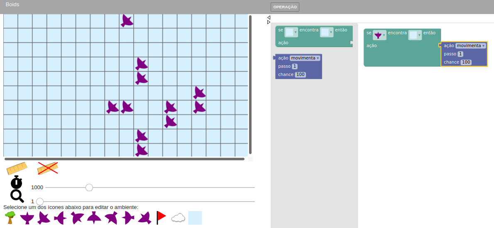
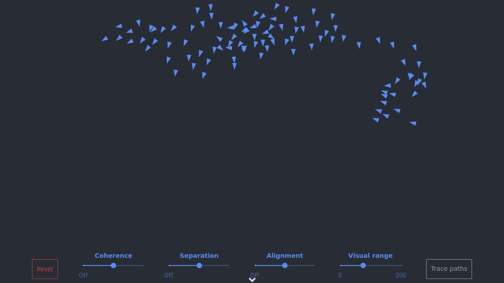

# Simulando Boids

## Influência das Cores

## Boids

## Boids implementado por Ben Eater

## Imagens que serviram de base para criações

* [Pássaros](https://pixabay.com/vectors/flock-birds-animals-pigeons-flying-1837494/)